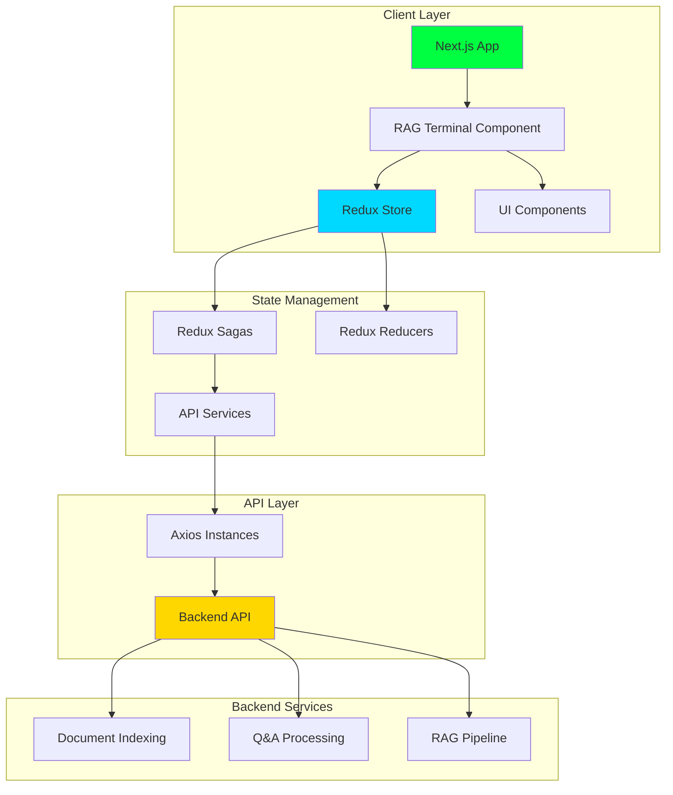
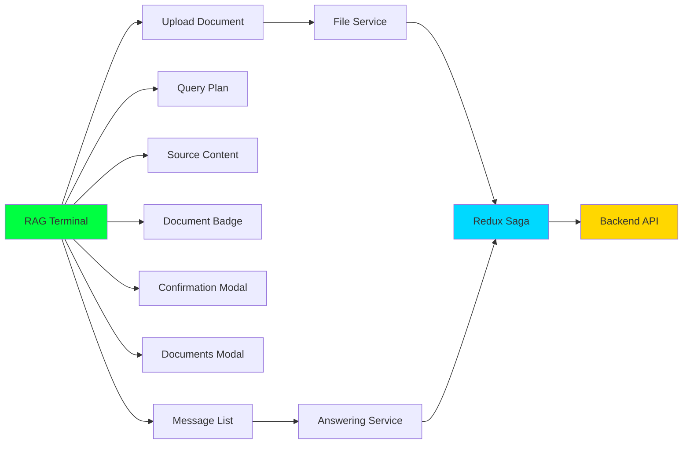
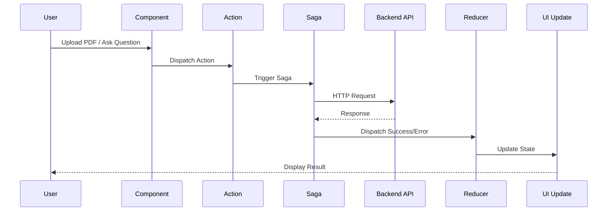
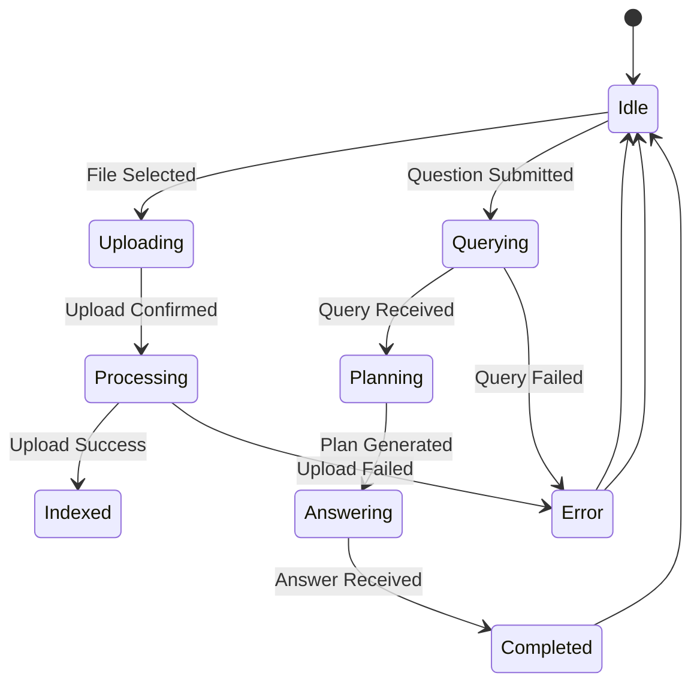

# IKMS-Frontend_STEMLink

<div align="center">


**A modern, terminal-style RAG (Retrieval-Augmented Generation) chatbot interface with PDF document upload and intelligent query planning capabilities.**

[Features](#-features) • [Installation](#-installation) • [Usage](#-usage) • [Architecture](#-architecture)

</div>

---


## 📋 Table of Contents

- [Overview](#-overview)
- [Features](#-features)
- [Tech Stack](#-tech-stack)
- [Architecture](#-architecture)
- [Project Structure](#-project-structure)
- [Installation](#-installation)
- [Configuration](#-configuration)
- [Usage](#-usage)
- [API Integration](#-api-integration)


---

## 🎯 Overview

**IKMS-Frontend_STEMLink** is a sophisticated frontend application that provides a terminal-style interface for interacting with a RAG (Retrieval-Augmented Generation) system. The application enables users to upload PDF documents, query them using natural language, and receive AI-generated answers with transparent query planning and source citations.

### Key Highlights

- 🖥️ **Terminal-Style UI**: Modern, monospace interface inspired by command-line terminals
- 📄 **PDF Document Management**: Upload, index, and manage multiple PDF documents
- 🤖 **Intelligent Q&A**: Ask questions and get AI-powered answers with source citations
- 📊 **Query Planning**: Visualize how the AI breaks down and processes your queries
- 🔍 **Source Transparency**: View exact document chunks and pages used in answers
- 🎨 **Dark Theme**: Beautiful dark theme optimized for extended use

---

## ✨ Features

### Core Features

- **📤 Document Upload**
  - Multiple PDF file upload support
  - Real-time upload progress tracking
  - Document indexing status display
  - Chunk count visualization

- **💬 Interactive Chat**
  - Real-time message exchange
  - Session-based conversation management
  - Loading states with animated indicators
  - Message history with timestamps

- **🧠 Query Planning**
  - Visual query plan breakdown
  - Sub-question generation display
  - Search strategy visualization
  - Expandable/collapsible plan sections

- **📚 Source Citations**
  - Document chunk references
  - Page number tracking
  - Source content preview
  - Multiple source support per answer

- **🔄 Session Management**
  - Unique session ID generation
  - Session clearing functionality
  - Document persistence within session
  - Message history management

- **⚙️ User Controls**
  - Toggle query planning visibility
  - Document badge with quick access
  - Responsive design
  - Keyboard shortcuts (Enter to send)

---

## 🛠️ Tech Stack

### Frontend Framework
- **Next.js 16.0.10** - React framework with App Router
- **React 19.2.0** - UI library
- **TypeScript 5.0** - Type safety

### State Management
- **Redux Toolkit 2.11.2** - State management
- **Redux Saga 1.4.2** - Side effect management
- **React Redux 9.2.0** - React bindings

### UI Components & Styling
- **Tailwind CSS 4.1.9** - Utility-first CSS
- **Radix UI** - Accessible component primitives
- **Lucide React** - Icon library
- **next-themes** - Theme management

### HTTP Client
- **Axios 1.13.2** - HTTP client with interceptors

### Form Handling
- **React Hook Form 7.60.0** - Form management
- **Zod 3.25.76** - Schema validation
- **@hookform/resolvers** - Form validation resolvers

### Development Tools
- **ESLint** - Code linting
- **TypeScript** - Static type checking
- **Vercel Analytics** - Analytics integration

---

## 🏗️ Architecture

### System Architecture



### Component Architecture



### Data Flow



### State Management Flow



---

## 📁 Project Structure

```
IKMS-Frontend_STEMLink/
├── app/                          # Next.js App Router
│   ├── globals.css              # Global styles
│   ├── layout.tsx               # Root layout
│   ├── page.tsx                 # Home page
│   └── provider.tsx             # Redux provider wrapper
│
├── components/                   # React components
│   ├── rag-terminal/            # Main RAG terminal component
│   │   ├── rag-terminal.tsx    # Main terminal component
│   │   ├── confirmation-modal/ # Session clear confirmation
│   │   ├── document-badge/      # Document count badge
│   │   ├── loaded-document/     # Document list modal
│   │   ├── pipeline-status/     # Processing status
│   │   ├── query-plan/          # Query planning display
│   │   ├── source-content/      # Source citations
│   │   └── upload-document/     # File upload modal
│   └── theme-provider.tsx       # Theme context provider
│
├── core/                         # Core utilities
│   └── exceptionHandler.ts      # Error handling
│
├── hooks/                        # Custom React hooks
│   └── use-mobile.ts            # Mobile detection hook
│
├── lib/                          # Utility libraries
│   └── utils.ts                 # Common utilities
│
├── public/                       # Static assets
│   └── icon-light-32x32.png    # App icon
│
├── redux/                        # Redux state management
│   ├── actions/                 # Action creators
│   │   ├── answering.actions.ts
│   │   ├── file.actions.ts
│   │   └── index.ts
│   ├── reducers/                # State reducers
│   │   ├── answering.reducer.ts
│   │   ├── file.reducer.ts
│   │   └── index.ts
│   ├── sagas/                   # Side effect handlers
│   │   ├── answering.saga.ts
│   │   ├── file.saga.ts
│   │   └── index.ts
│   └── store/                   # Store configuration
│       └── index.ts
│
├── service/                      # API services
│   ├── answering.service.ts     # Q&A API calls
│   ├── file.service.ts          # File upload API calls
│   └── index.ts                 # Axios instances
│
├── styles/                       # Additional styles
│   └── globals.css
│
├── utilities/                    # Utility functions
│   ├── constants/               # Application constants
│   │   └── action.constants.ts
│   ├── helper/                  # Helper functions
│   │   └── context.ts           # Context parsing
│   └── models/                  # TypeScript interfaces
│       ├── answering.model.ts
│       ├── chat.model.ts
│       └── file.model.ts
│
├── components.json               # shadcn/ui config
├── eslint.config.mjs            # ESLint configuration
├── next.config.mjs              # Next.js configuration
├── package.json                 # Dependencies
├── postcss.config.mjs          # PostCSS configuration
├── tsconfig.json                # TypeScript configuration
└── README.md                    # This file
```

---

## 🚀 Installation

### Prerequisites

- **Node.js** 18.x or higher
- **npm**, **yarn**, or **pnpm** package manager
- **Backend API** endpoint (see Configuration)

### Step 1: Clone the Repository

```bash
git clone <repository-url>
cd IKMS-Frontend_STEMLink
```

### Step 2: Install Dependencies

Using **npm**:
```bash
npm install
```

Using **yarn**:
```bash
yarn install
```

Using **pnpm**:
```bash
pnpm install
```

### Step 3: Configure Environment Variables

Create a `.env.local` file in the root directory:

```env
# Backend API Base URL
NEXT_PUBLIC_API_BASE=http://localhost:8000/api

# Environment (dev, local, production)
NEXT_PUBLIC_APP_ENV=local
```

### Step 4: Run Development Server

```bash
npm run dev
# or
yarn dev
# or
pnpm dev
```

The application will be available at `http://localhost:3000`

### Step 5: Build for Production

```bash
npm run build
npm start
```

---

## ⚙️ Configuration

### Environment Variables

| Variable | Description | Default | Required |
|----------|-------------|---------|----------|
| `NEXT_PUBLIC_API_BASE` | Backend API base URL | - | Yes |
| `NEXT_PUBLIC_APP_ENV` | Environment mode (dev/local/production) | - | Yes |

### Next.js Configuration

The project uses a custom `next.config.mjs` with:
- TypeScript build errors ignored (for development)
- Unoptimized images (for compatibility)

### Redux Store Configuration

- **Development**: Redux logger enabled
- **Production**: Logger disabled, DevTools disabled
- **Saga Middleware**: Always enabled for async operations

---

## 💻 Usage

### Starting a Session

1. **Launch the Application**: Open `http://localhost:3000`
2. **Session Initialization**: A new session is automatically created on page load
3. **Session ID**: Unique session ID is generated (format: `session_{timestamp}_{uuid}`)

### Uploading Documents

1. **Click the Paperclip Icon**: Located in the input field
2. **Select PDF Files**: Choose one or multiple PDF files
3. **Review Staged Files**: Files appear in the upload modal
4. **Confirm Upload**: Click "Upload" to process files
5. **Monitor Progress**: Watch the indexing status
6. **View Documents**: Click the document badge to see all uploaded files

### Asking Questions

1. **Type Your Question**: Enter your query in the input field
2. **Send**: Press Enter or click the Send button
3. **View Query Plan**: Expand the query plan to see how the AI processes your question
4. **Read Answer**: View the AI-generated response
5. **Check Sources**: Expand sources to see document chunks and page references

### Managing Sessions

- **Clear Session**: Click the reset button (↻) in the header
- **Confirm Clear**: Confirm the action in the modal
- **New Session**: A fresh session is automatically created

### Toggle Features

- **Query Planning**: Toggle visibility in the status bar checkbox
- **Document Badge**: Click to view all uploaded documents

---


## 🔌 API Integration

### Endpoints

#### Document Upload

```typescript
POST /index-pdf
Content-Type: multipart/form-data

Body: FormData {
  file: File
}

Response: {
  filename: string
  chunks_indexed: number
  message: string
}
```

#### Question Answering

```typescript
POST /qa
Content-Type: application/json

Body: {
  question: string
  session_id?: string
}

Response: {
  answer: string
  context: string
  plan?: string
  sub_questions?: string[]
  session_id: string
}
```


[⬆ Back to Top](#ikms-frontend_stemlink)

</div>
